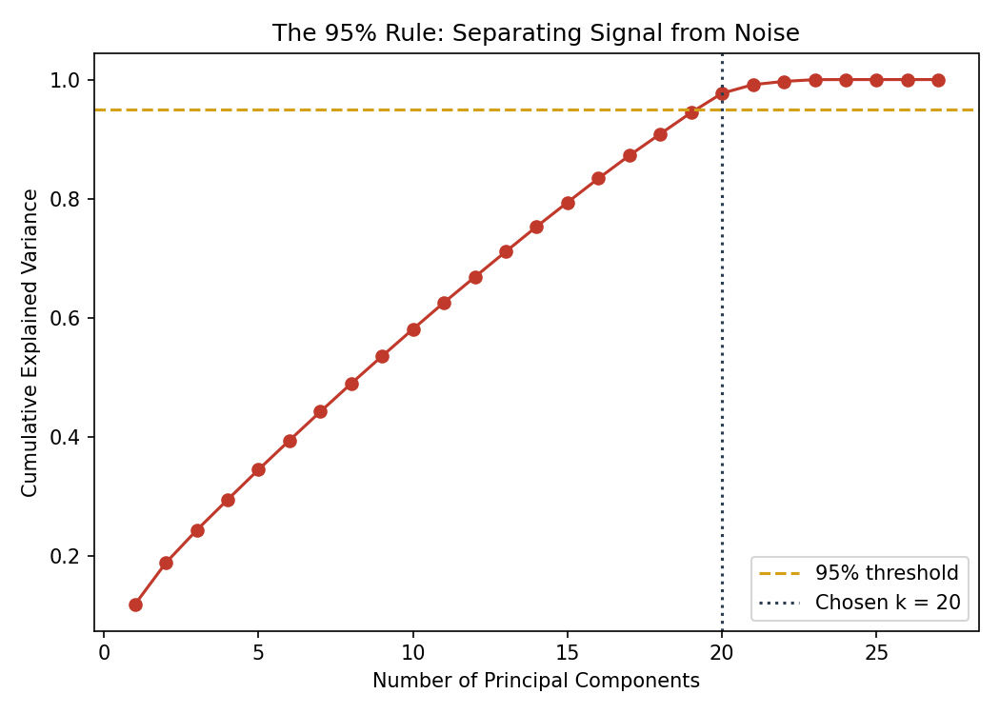
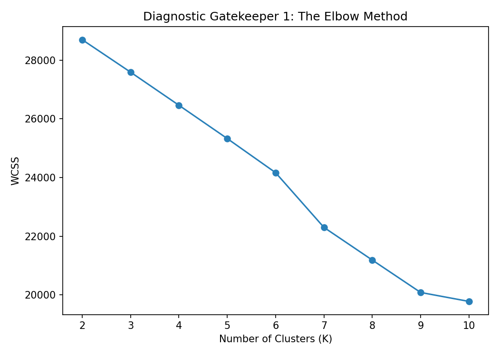
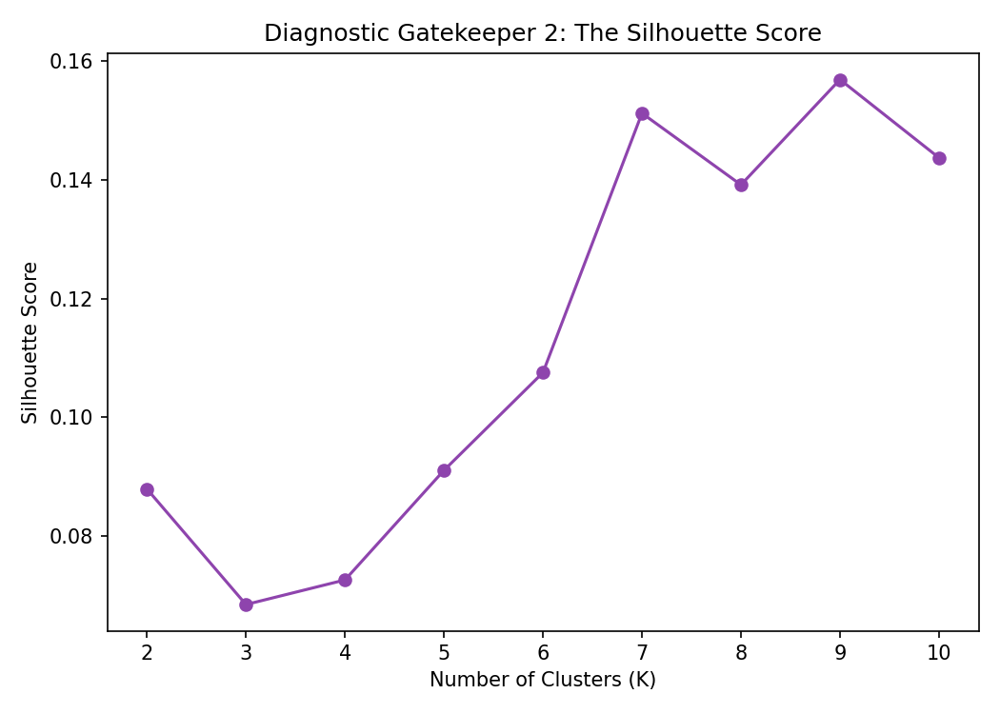
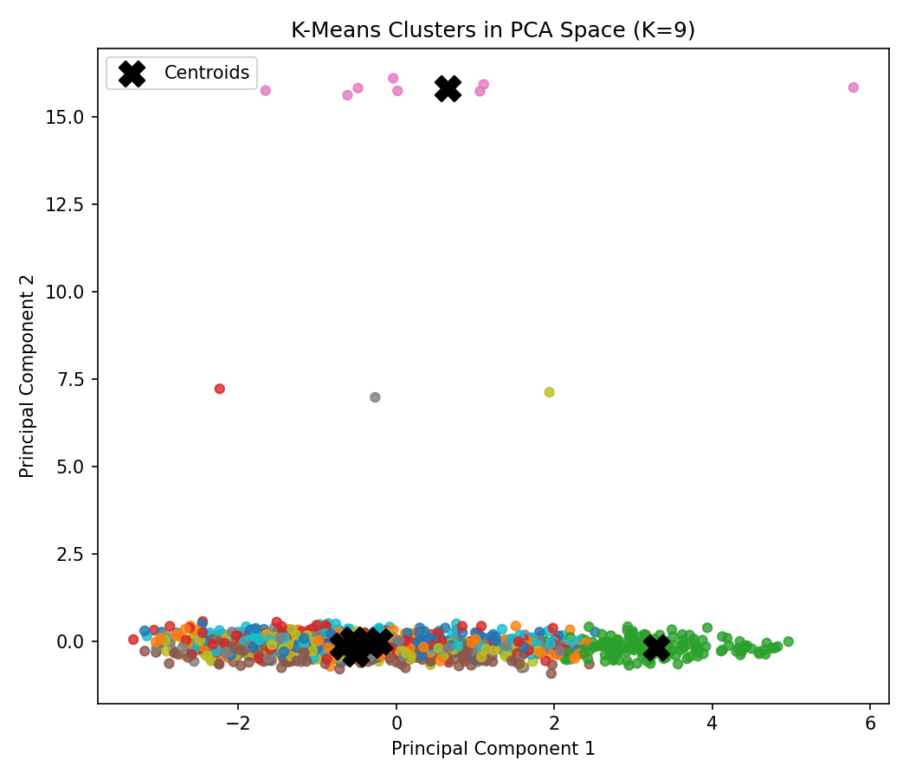

# 🛍️ Customer Segmentation using Unsupervised Learning

<p align="center">
  
  
  
</p>

<p align="center">
  <b>Scale → Compress (PCA) → Cluster (K-Means) → Translate</b>
</p>

---

## 📌 Project Overview

This project focuses on **Customer Segmentation using Unsupervised Learning**.

The objective is to use a distance-based clustering algorithm, **K-Means**, to discover hidden mathematical groupings in unlabeled retail order data and translate those groups into meaningful customer personas.

The complete workflow is:

```text
Raw Order Data
      ↓
Feature Engineering
      ↓
Standard Scaling
      ↓
PCA Dimensionality Reduction
      ↓
K-Means Clustering
      ↓
Elbow Method + Silhouette Score
      ↓
Cluster Visualization
      ↓
Customer Personas
```

---

## 🎯 Project Goal

The main goals of this project are:

- 🧩 Convert order-level transactional data into customer-level behavioral features.
- 📏 Standardize features so that large-scale variables do not dominate clustering.
- 🧠 Apply **PCA** to compress a high-dimensional feature space.
- 🔍 Determine the appropriate number of clusters using:
  - Elbow Method
  - Silhouette Score
- 👥 Apply **K-Means Clustering** to segment customers.
- 💡 Translate mathematical clusters into human-readable business personas.

---

## 📂 Input Dataset

The project uses:

`DOC-20260810-WA0013.csv`

The raw dataset contains order-level transactional information.

The code loads the data and reports the number of orders and unique customers.

---

## 🧪 Feature Engineering

The raw order-level data is transformed into customer-level behavioral features.

Core features include:

| Feature | Description |
|---|---|
| `total_spend` | Total amount spent by the customer |
| `avg_order_value` | Average order value |
| `order_count` | Number of orders |
| `avg_quantity` | Average quantity ordered |
| `avg_unit_price` | Average unit price |
| `avg_items_in_cart` | Average number of items in cart |
| `coupon_usage_rate` | Rate of coupon usage |
| `bad_outcome_rate` | Rate of cancelled/returned orders |
| `product_diversity` | Number of unique products purchased |
| `recency_days` | Days since the customer's latest order |

Categorical behavior is also converted into customer-level ratios for:

- 💳 Payment Method
- 📣 Referral Source
- 🛒 Product Mix

---

## ⚙️ Technologies Used

<p>


</p>

### Main Libraries

```python
import numpy as np
import pandas as pd
import matplotlib.pyplot as plt

from sklearn.preprocessing import StandardScaler
from sklearn.decomposition import PCA
from sklearn.cluster import KMeans
from sklearn.metrics import silhouette_score
```

---

# 🔄 Methodology

## 1️⃣ Load Raw Data

The transactional dataset is loaded using Pandas, with the `Date` column parsed as a date.

```python
raw = pd.read_csv(INPUT_CSV, parse_dates=["Date"])
```

---

## 2️⃣ Feature Engineering

Order-level records are aggregated by `CustomerID`.

```python
agg = raw.groupby("CustomerID").agg(
    total_spend=("TotalPrice", "sum"),
    avg_order_value=("TotalPrice", "mean"),
    order_count=("OrderID", "count"),
    avg_quantity=("Quantity", "mean"),
    avg_unit_price=("UnitPrice", "mean"),
    avg_items_in_cart=("ItemsInCart", "mean"),
    coupon_usage_rate=("is_coupon", "mean"),
    bad_outcome_rate=("is_bad_outcome", "mean"),
    product_diversity=("Product", "nunique"),
    last_order_date=("Date", "max")
).reset_index()
```

This creates a customer-level representation of purchasing behavior.

---

## 3️⃣ Standard Scaling

Because the features have different numerical ranges, **StandardScaler** is used.

```python
scaler = StandardScaler()
X_scaled = scaler.fit_transform(X)
```

This prevents high-magnitude variables such as total spending from dominating smaller behavioral variables.

---

## 4️⃣ 🧠 PCA Dimensionality Reduction

**Principal Component Analysis (PCA)** is used to compress the feature space while retaining **at least 95% cumulative explained variance**.

```python
pca_full = PCA(random_state=RANDOM_STATE).fit(X_scaled)

cum_var = np.cumsum(
    pca_full.explained_variance_ratio_
)

n_components = int(
    np.argmax(cum_var >= 0.95) + 1
)
```

### PCA Output

The project generates:

**`pca_variance.png`**

This visualization shows the cumulative explained variance and the 95% threshold.

### 📊 PCA Variance Plot

> Place your generated `pca_variance.png` file in the `outputs/` folder.



---

# 🔬 5️⃣ Choosing the Optimal Number of Clusters

The project evaluates cluster values from **K = 2 to K = 10**.

Two diagnostic methods are used.

---

## 📉 Elbow Method

The Elbow Method evaluates the **Within-Cluster Sum of Squares (WCSS)** for different values of K.

```python
for k in K_RANGE:
    km = KMeans(
        n_clusters=k,
        random_state=RANDOM_STATE,
        n_init=10
    )
    labels = km.fit_predict(X_pca)
    wcss.append(km.inertia_)
```

### 📊 Elbow Method Output



The elbow curve helps identify a point where increasing the number of clusters provides diminishing improvement.

---

## 📈 Silhouette Score

The Silhouette Score evaluates how well customers fit within their assigned clusters.

```python
sil_scores.append(
    silhouette_score(X_pca, labels)
)
```

The project selects the K value with the highest silhouette score.

```python
best_k = list(K_RANGE)[
    int(np.argmax(sil_scores))
]
```

### 📊 Silhouette Score Output



---

# 👥 6️⃣ K-Means Customer Clustering

After determining the optimal K, K-Means is applied to the PCA-transformed data.

```python
kmeans = KMeans(
    n_clusters=best_k,
    random_state=RANDOM_STATE,
    n_init=10
)

cluster_labels = kmeans.fit_predict(X_pca)
```

Each customer receives a cluster assignment.

---

# 🎨 7️⃣ PCA Cluster Visualization

The first two principal components are used to visualize the customer clusters.

```python
plt.scatter(
    X_pca[:, 0],
    X_pca[:, 1],
    c=cluster_labels,
    cmap="tab10",
    s=25,
    alpha=0.8
)
```

### 📊 Customer Clusters



This visualization provides a clear view of how customers are distributed across the discovered clusters.

---

# 🧑‍💼 8️⃣ Customer Personas

The mathematical clusters are translated into human-readable customer personas.

The project uses customer behavior such as:

- Average Order Value
- Coupon Usage
- Bad Outcome Rate
- Total Spend
- Order Count
- Recency
- Product Diversity

The generated personas include:

### 💎 High-Value Loyalist

Customers with relatively high average order value and lower coupon dependence.

### 🏷️ Budget-Conscious Explorer

Customers showing higher coupon usage and comparatively lower average order value.

### ⚠️ At-Risk / High-Return Customer

Customers associated with a higher rate of cancelled or returned orders.

### 🛒 Steady Mainstream Shopper

Customers whose behavior does not fall into the other defined persona categories.

---

# 📁 Generated Outputs

The Python program produces the following files:

```text
customer_features.csv
cluster_assignments.csv
persona_summary.csv

elbow_method.png
silhouette_scores.png
pca_variance.png
pca_clusters.png
```

| Output | Purpose |
|---|---|
| `customer_features.csv` | Engineered customer-level feature table |
| `cluster_assignments.csv` | Customer IDs with assigned clusters |
| `persona_summary.csv` | Human-readable cluster/persona summary |
| `elbow_method.png` | Elbow Method diagnostic |
| `silhouette_scores.png` | Silhouette Score diagnostic |
| `pca_variance.png` | PCA explained-variance visualization |
| `pca_clusters.png` | PCA-based cluster visualization |

---

# 📊 Project Architecture

```text
                    ┌──────────────────────┐
                    │   Retail Order Data  │
                    └──────────┬───────────┘
                               ↓
                    ┌──────────────────────┐
                    │ Feature Engineering  │
                    └──────────┬───────────┘
                               ↓
                    ┌──────────────────────┐
                    │  StandardScaler      │
                    └──────────┬───────────┘
                               ↓
                    ┌──────────────────────┐
                    │        PCA           │
                    │   95% Variance       │
                    └──────────┬───────────┘
                               ↓
                 ┌───────────────────────────┐
                 │ K-Means Cluster Selection │
                 │ Elbow + Silhouette Score │
                 └─────────────┬─────────────┘
                               ↓
                    ┌──────────────────────┐
                    │  K-Means Clustering  │
                    └──────────┬───────────┘
                               ↓
                    ┌──────────────────────┐
                    │ Customer Segments    │
                    └──────────┬───────────┘
                               ↓
                    ┌──────────────────────┐
                    │ Business Personas    │
                    └──────────────────────┘
```

---

# 💡 Key Learning Outcomes

Through this project, I worked with:

- ✅ Unsupervised Machine Learning
- ✅ Customer-level feature engineering
- ✅ Feature scaling
- ✅ Principal Component Analysis
- ✅ K-Means clustering
- ✅ Elbow Method
- ✅ Silhouette Score
- ✅ Cluster visualization
- ✅ Business-oriented customer personas
- ✅ Data-driven customer segmentation

---

# 🚀 Business Applications

Customer segmentation can help businesses:

- 🎯 Create targeted marketing campaigns
- 💰 Identify high-value customers
- 🏷️ Understand discount-sensitive customers
- ⚠️ Identify customers with high return/cancellation behavior
- 📦 Understand purchasing patterns
- 🤝 Develop personalized customer strategies

---

# 📌 Project Status

**Project 3 — Completed ✅**

**Category:** Unsupervised Learning  
**Task:** Customer Segmentation  
**Algorithm:** K-Means  
**Dimensionality Reduction:** PCA  
**Validation:** Elbow Method + Silhouette Score

---

## 👨‍💻 Author

**Karthikeyan G**

Vit MscData Science Student

---

<p align="center">
  ⭐ If you found this project useful, consider giving it a star!
</p>
